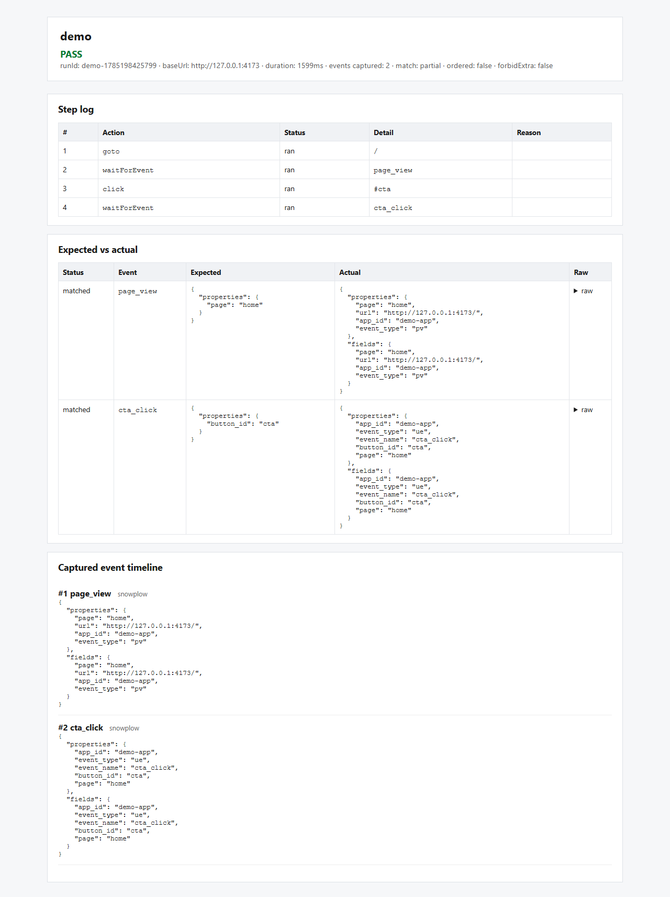

# Akela

Verify Snowplow (and future analytics platforms) events in the browser. Clone this repo, run a journey, open an HTML report.



## Quick start

```bash
npm install
npx playwright install chromium
```

Terminal 1 — local demo site (fires Snowplow-like beacons):

```bash
npm run demo
```

Terminal 2 — run the example journey:

```bash
npm run track -- run journeys/demo.yaml
```

Open the printed `report.html` path. You should see **PASS** with `page_view` and `cta_click`.

## Project layout

Plans and journeys can live in any directories. Pass paths explicitly to `validate`, `generate`, `record`, `run`, and `auth`.

Defaults (overridable in `akela.config.yaml`):

| Key | Default | Used for |
|-----|---------|----------|
| `plansDir` | `plans` | Convention / `init` scaffold (not auto-prefixed onto CLI args) |
| `journeysDir` | `journeys` | Default `--out` for `generate` / `record`, and `init` examples |
| `reportDir` | `reports` | HTML/JSON/Markdown reports |

Examples in this repo use `plans/` and `journeys/` for familiarity.

## Point at a real / staging site

Copy the template and customize:

```bash
cp journeys/staging-smoke.example.yaml journeys/staging-smoke.yaml
```

1. Set `baseUrl` to your staging host.
2. Copy/adapt `journeys/login.example.yaml` for your login flow.
3. `npm run track -- auth journeys/login.yaml --var AUTH_EMAIL=… --var AUTH_PASSWORD=…` (headed by default).
4. Point tracking journey `storageState` at the printed path — **do not commit** `.auth/`.
5. Prefer default `gotoWaitUntil: domcontentloaded` (or `load`) plus `waitForSelector` for SPA readiness. Avoid `networkidle` on apps that keep analytics/polling traffic open — it often hangs or flakes.
6. Fill real selectors / `waitForEvent` / `expect` rows. Prefer `waitForEvent` / `waitForSelector` over fixed `wait` sleeps.
7. Run: `npm run track -- run journeys/staging-smoke.yaml`

Example shape:

```yaml
name: checkout
baseUrl: https://staging.example.com
storageState: .auth/storage-state.json
gotoWaitUntil: domcontentloaded
adapters:
  - snowplow
steps:
  - action: goto
    path: /checkout
  - action: waitForSelector
    selector: "#pay"
  - action: click
    selector: "#pay"
  - action: waitForEvent
    eventName: purchase
    timeoutMs: 8000
expect:
  - eventName: purchase
    properties:
      currency: USD
    fields:
      user_id: "abc"
```

Use `properties` for payload-only checks. Use `fields` when a value may live on the event payload **or** in an attached Snowplow context (e.g. entity IDs). Both may be set; both must match. `match: exact` applies only to `properties`; `fields` always matches as a deep subset.

Journeys must declare at least one `expect` event — an empty list is rejected (it would otherwise always PASS).

Network capture uses Playwright routing so `navigator.sendBeacon` (Snowplow ping) bodies are available. The collector pattern `/i` matches only a path ending in `/i` (not `/images` or font URLs containing `inter`).

Configure Snowplow collector URL fragments under `snowplow.collectorPatterns` so the adapter recognizes your collector host/path.

## CLI

```bash
npm run track -- init                    # scaffold config + example journey
npm run track -- validate <plan.csv>     # check canonical plan CSV format
npm run track -- generate <plan.csv>     # validate then write journey YAML
npm run track -- record <startUrl>       # record a draft journey (optionally --plan)
npm run track -- run <file>              # run a journey and write reports
npm run track -- run <file> --var name=value   # substitute ${name} in the journey
```

Exit code `0` = pass, `1` = fail. Invalid journey YAML fails at load with schema errors (Zod).

### Journey variables (`run --var`)

Any journey may use `${name}` placeholders (letters, digits, underscore). Pass values at run time — repeatable, and multiple names per run:

```bash
npm run track -- run journeys/checkout.yaml --var product_id=450
npm run track -- run journeys/checkout.yaml --var currency=USD --var sku=abc
```

Substitution runs on the file text **before** YAML/JSON parse. Unquoted `${product_id}` becomes a YAML number when the value is numeric; quote it (`"${product_id}"`) to keep a string. Missing placeholders fail the load with a clear error. Unused `--var` flags are ignored.

Numeric expects soft-match string wire values: `fields: { product_id: 450 }` matches an actual `"450"` (and the reverse). Non-canonical strings like `"450px"` still fail.

While a journey runs, the CLI prints live progress (step start/skip/retry, captured event names, `waitForEvent` waiting/found, quiet drain, verify). On failure it also writes `failure.png` into the report folder when a page was open.

## Failure diagnosis

Failed tracking runs include a structured `diagnosis` object in `report.json` (and a Diagnosis section in HTML/Markdown). CLI and reports lead with a human summary, guidance, and a short primary finding list; full technical findings stay in JSON and under “Technical findings” / `explain --verbose`. Codes are stable for SaaS consumers (`findings[].code`). Diagnosis never changes pass/fail.

```bash
npm run track -- explain reports/<runId>
npm run track -- explain reports/<runId> --verbose
npm run track -- explain reports/<runId>/report.json --json
```

Optional LLM prose belongs in a future SaaS layer that calls this CLI/API — not in this package.

## Journey steps

| Action | Fields | Notes |
|--------|--------|-------|
| `goto` | `path` | Uses `gotoWaitUntil` from journey or config (default `domcontentloaded`) |
| `click` | `selector`, `timeoutMs?`, `retries?` | Optional Playwright timeout; `retries` re-attempts after failure (default 0) |
| `fill` | `selector`, `value`, `timeoutMs?`, `retries?` | Same timeout/retry options as `click` |
| `wait` | `timeoutMs` | Fixed sleep — prefer `waitForEvent` / `waitForSelector` when possible |
| `waitForSelector` | `selector`, `timeoutMs?`, `state?` | Default state `visible` |
| `waitForAny` | `selectors` (min 2), `timeoutMs?` | Wait until **any** selector is visible (UI fork detection) |
| `waitForHydrated` | `selector`, `timeoutMs?` (default 15000) | Wait until React has attached handlers to the element. Use before interacting with server-rendered forms — see below |
| `waitForURL` | `url`, `timeoutMs?` | Glob/string as Playwright |
| `waitForEvent` | `eventName`, `timeoutMs?`, `properties?`, `fields?` | Poll captured analytics; ignores events from before the previous step started (so beacons during `goto`/`click` still count) |
| `scroll` | `selector?`, `timeoutMs?` | Omit selector to scroll the page; with a selector, scrolls inside overflow containers or brings the element into view. Recorder captures scroll (debounced) |

Every step may include optional `when.visible: "<selector>"`. The runner waits briefly (~500ms) for that selector to become visible; if it does not, the step is **skipped** (no error) and logged in the report step log. Use with `waitForAny` for opt-in branching in one journey; omit both for a strictly linear journey (separate files per branch remain fine).

```yaml
- action: waitForAny
  selectors:
    - "[data-testid=market-selection-page]"
    - "[data-testid=payment-page]"
- action: click
  selector: "[data-testid=market-toggle] >> nth=0"
  when:
    visible: "[data-testid=market-selection-page]"
```

### Server-rendered forms and hydration

On SSR apps (Next.js and similar), markup is **visible before it is interactive**. `waitForSelector` is satisfied by the server HTML, so a `fill` + `click` can land in the gap before React attaches handlers — on real pages this window has been measured at ~2 seconds. Clicking a `type="submit"` button in that window makes the browser submit the form **natively** instead of running the app's `onSubmit`, which reloads the page, wipes uncontrolled inputs, and skips whatever the handler was supposed to do. `gotoWaitUntil: load` does not help, because hydration finishes after the `load` event.

Guard interactive steps with `waitForHydrated` on the element you are about to click:

```yaml
- action: waitForSelector
  selector: "[data-testid=email]"
- action: waitForHydrated
  selector: "[data-testid=submit]"
- action: fill
  selector: "[data-testid=email]"
  value: "${AUTH_EMAIL}"
- action: click
  selector: "[data-testid=submit]"
```

Journey-level / config: `storageState`, `gotoWaitUntil` (`load` \| `domcontentloaded` \| `networkidle` \| `commit`). Prefer `domcontentloaded` or `load` for analytics-heavy SPAs; reserve `networkidle` for pages without ongoing background requests.

Config also accepts `quietMs` (default `200`) and `quietTimeoutMs` (default `2000`) for the late-beacon drain (`quietTimeoutMs` must be `>= quietMs`). Invalid config values fail at load with a clear Zod error. The quiet wait runs after success **and** after step failures (before the browser closes) so in-flight beacons still appear in the report. Capture/parse warnings are listed in the CLI summary and HTML/Markdown reports. Missing expects show a near-miss diff when an unused event with the same `eventName` exists. Expect-only failures capture `failure.png` before the browser closes.

## Recording journeys

Typical handoff: PM authors a plan CSV → eng runs `record --plan` against a real page → review coverage → `run` the draft.

```bash
# Terminal 1
npm run demo

# Terminal 2 — record against the demo (headed by default; press Enter to stop)
npm run track -- record http://127.0.0.1:4173/ --plan plans/demo.csv --out journeys/demo-recorded.yaml
```

Coverage prints matched / missing / unexpected plan rows. Exit `1` if any plan events are missing (unless `--allow-incomplete`). Then:

```bash
npm run track -- run journeys/demo-recorded.yaml
```

`generate` remains available for CSV scaffolding without a browser session. Prefer stable selectors: `data-analytics-id`, then `data-testid`, then `#id` (fragile CSS last). Demo CTA uses both `id="cta"` and `data-analytics-id="demo-cta"`.

Useful flags:

- `--plan <plan.csv>` — seed expects and coverage from the plan
- `--out <file>` / `--name <name>` — draft path and journey name (default `{journeysDir}/<name>.yaml` from config)
- `--overwrite` — replace an existing draft
- `--allow-incomplete` — exit `0` even when plan events are missing
- `--include-unplanned` — also expect unplanned captured events
- `--force` — write a draft even when zero steps were recorded
- `--storage-state <file>` — reuse auth storage from `auth`
- `--adapters a,b` / `--base-url <url>` — override defaults

## Generate a journey from a CSV plan

Plans must use the **canonical** CSV columns below. Extra columns (e.g. Priority, comments) are allowed and ignored. `validate` checks the file; `generate` validates first and only writes a journey on PASS.

**For PMs / non-technical authors:** use the Cursor skill [analytics-plan-csv](.cursor/skills/analytics-plan-csv/SKILL.md) to turn a free-form tracking plan into this CSV. Leave `selector` blank when you do not know CSS or test IDs — generate inserts `#TODO-*` placeholders for developers (`scroll` with empty selector = page scroll, no TODO).

```bash
npm run track -- validate plans/demo.csv
npm run track -- generate plans/demo.csv
# optional overrides (= form; quote in PowerShell):
npm run track -- generate plans/demo.csv --name=checkout '--out=journeys/checkout.yaml' --overwrite
```

Canonical CSV columns:

| Column | Required | Meaning |
|--------|----------|---------|
| `eventName` | yes | Event to wait for / expect |
| `trigger` | yes | `page_load`, `click`, `fill`, or `scroll` |
| `path` | for `page_load` | Page path for `goto` |
| `selector` | no | CSS selector; defaults to `#TODO-<event-slug>` for click/fill |
| `value` | for `fill` | Input value |
| `properties` | no | JSON object — match against event payload only |
| `fields` | no | JSON object — match against flattened payload + contexts |
| `notes` | no | Becomes a YAML comment above that step |

Example (`plans/demo.csv`):

```csv
eventName,trigger,path,selector,value,properties,fields,notes
page_view,page_load,/,,,"{""page"":""home""}",,Home page load
cta_click,click,,#cta,,"{""button_id"":""cta""}",,Click primary CTA
```

Defaults: journey name from the CSV filename, `adapters: [snowplow]`, output `{journeysDir}/<name>.yaml` (config key `journeysDir`, default `journeys`). Use `--overwrite` to replace an existing file. Pass `--out` to write anywhere.

## TypeScript API

```ts
import { runJourney } from "./src/api/runJourney.js";

const result = await runJourney(
  {
    name: "checkout",
    adapters: ["snowplow"],
    steps: [
      { action: "goto", path: "/" },
      { action: "click", selector: "#cta" },
    ],
    expect: [{ eventName: "cta_click", properties: { button_id: "cta" } }],
  },
  { onProgress: (message) => console.log(message) },
);
```

## Journey options

| Option | Default | Meaning |
|--------|---------|---------|
| `ordered` | `false` | Require expected events in order |
| `match` | `partial` | `partial` (subset) or `exact` for **properties** only |
| `forbidExtra` | `false` | Fail if unexpected events were captured |

## Properties vs fields

| Expect key | Matches | Typical use |
|------------|---------|-------------|
| `properties` | Event payload only | Page, element, counts on the self-describing event |
| `fields` | Payload + Snowplow contexts (flattened) | Entity IDs / values that may arrive in `cx` |

Snowplow `fields` flattening: start from the event payload; for each context, merge each `data` key if absent (payload wins on collision); always also add a schema-qualified key `{context_schema_name}.{property}` derived from the Iglu entity name. Prefer bare keys when uniqueness is clear; use the qualified form when the same property name appears on the payload or across contexts.

## Adding another platform later

1. Implement `AnalyticsAdapter` (`matches` + `parse` → `NormalizedEvent[]` with both `properties` and `fields`)
2. Register it in `createDefaultRegistry`
3. Add the adapter name to the journey `adapters` list

For non-context platforms, set `fields` equal to `properties`. Verifier and reports stay the same.

## Tests

```bash
npm test
npm run ci    # vitest + tsc (same checks as GitHub Actions)
```
